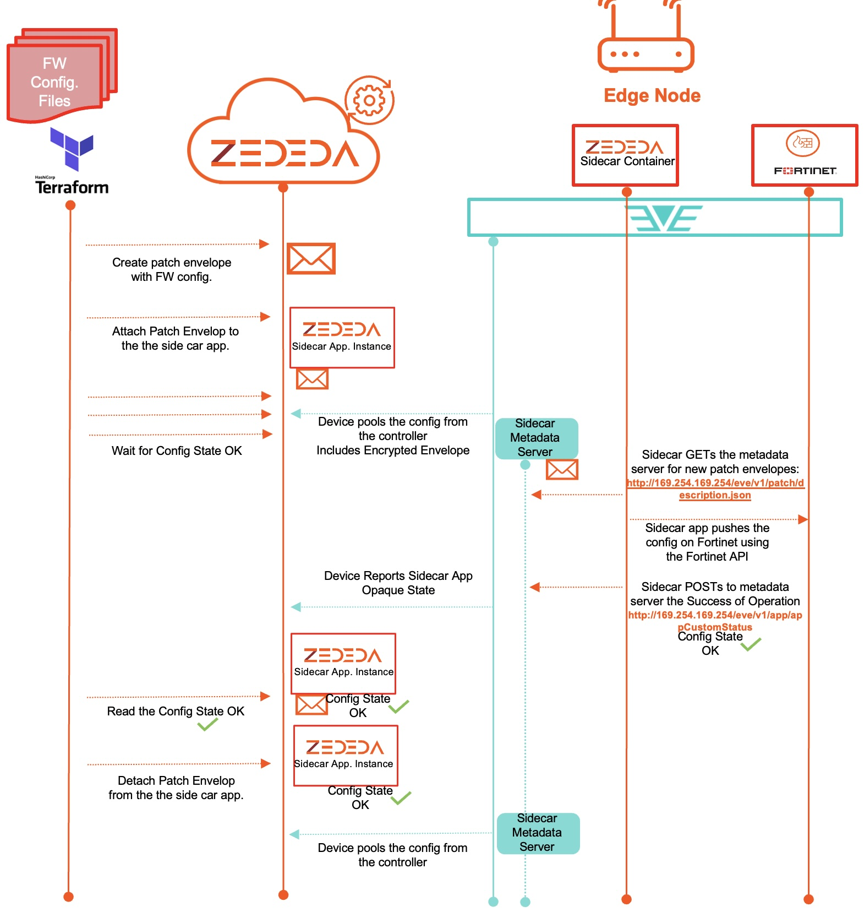

### Sidecar Application for fortinet firewall management.

This repository presents the automation workflow to update the Fortinet Firewall configuration using the ZEDEDA's Inventory and Configuration Services (ZICS).

It uses the ZEDEDA's terraform provider whose version is defined under the [versions.tf](./versions.tf) file.

User must provide provide the ZEDEDA cloud API url and the corresponding access token in the [provider.tf](./provider.tf) file:

```
provider "zedcloud" {
    zedcloud_url = "https://zedcontrol.zededa.net" #### Pick the cluster where you will be executing these commands against.
  # Configuration options
    zedcloud_token = "###INSERT ZEDEDA API TOKEN"

}
```

The workflow is presented in the following picture and assumes that there's an EVE OS device hosting a Fortinet Firewall and the ZEDEDA sidecar container application for Fortinet Firewall configuration management.




The terraform apply will create a patch envelop construct in ZEDEDA controller including the:
- **firewall configuration**
- **firewall API token**
- **firewall FQDN or IP**

## Variables

Update your the bash [script](./update_forti_config.sh) to reflect the same timezone that is configured on your Edge Devices.

````
export TZ="Europe/Lisbon"
````

Populate the values of the variables in [variables.tf](./variables.tf)


## How to run
````
terraform init
./update_forti_config.sh
````

